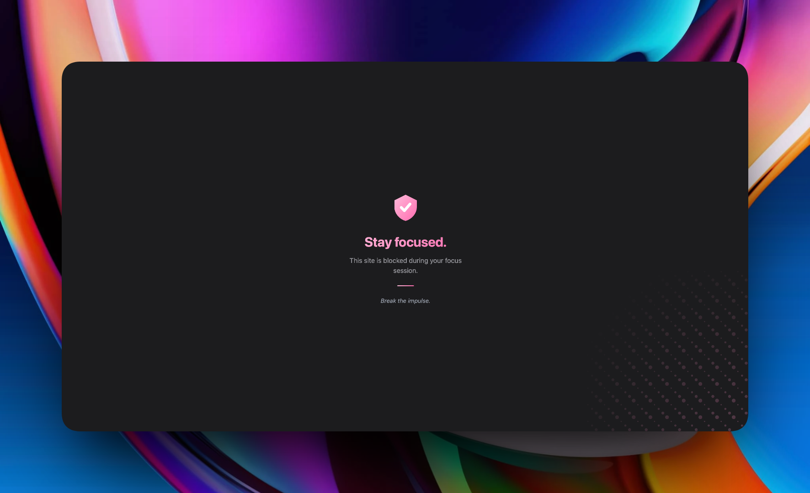

# blockMax

Open-source, bloat-free and fast tool for Safari. Focus by blocking websites within certain times.

  
  
  

---

This tool is a Safari-only utility designed to break the impulsive habit of opening social media or addictive websites by blocking them during specified time periods. While similar tools exist, they are often bloated with unnecessary features; **blockMax** keeps it lightweight, fast, and focused.

   
  

---

## Installation
